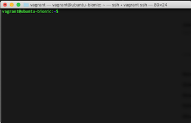

# Bash I

## What is bash ?
Bash is a text only interface to the operating system, specifically the [Unix](https://en.wikipedia.org/wiki/Unix) based operating systems
of Linux and OSX. You are probably used to interacting with your computer using a mouse and
keyboard. You use these peripherals (externally connected devices) to interact with the GUI
(graphical user interface). Using a text only interface allows for a standardized way of interacting
with the operating system and its programs. This standard makes it easier to automate and manipulate
things. 

## Now what? 
Use it! Anything you can do in the GUI you can do in Bash. When you open up your terminal, you will
be put in the home directory that is made for you, the user. 

### Vocab
- Directory : basically a folder
- Object : a file or a directory
- Parameter : something (number, string, file) passed to a command to change behavior or make the command usable

Now, play around with some of these commands.

- `ls` will list the current objects in the directory; `ls -lh`, `ls /dev`
- `pwd` will tell you the directory you are currently in; `pwd` 
- `cd` will take a parameter to change a directory; `cd /dev`
- `touch` will create a file; `touch file.txt`
- `rm` will delete a file, Note - this does not go to the trash, it is gone forever; `rm file.txt`
- `mkdir` will create a directory; `mkdir test`
- `rmdir` will remove a directory; `rmdir test`
- `mv` will move a file from one location to another; `mv file.txt newfile.txt`
- `cp` will copy a file into a new location; `cp file.txt copiedfile.txt`
- `cat` is short for concatenate, but is mainly used for display contents of a file; `cat file.txt`
- `head` / `tail` will display part of the beginning or the end of a file, useful for large files; `head file.txt`
- `man` brings up man pages for relevant commands, -K is a useful flag; `man cd`

### Tips and Tricks
- You can hit tab to autocomplete a command, hitting tab twice will give you more options
- The up and down arrows cycle through your bash history of commands
- Ctrl+(c/d/z) will either kill a running program, logout, or send a program to the background
- `!!` will run the previous command
- `.` is shorthand for the current directory, and `..` is shorthand for the past directory. `~` is
  shorthand for the home directory.

### Flags and arguments
Most the commands you use will contain not just a command, but arguments and also flags. For
example, `cd /usr` or `touch myfile.txt`. Flags specify other behavior such as `ls -lh` or `rm -rf`. 

These commands will help you do a lot of file manipulation and maneuvering around. 

### Editing files

In this class, we are only using the terminal, so we need to be able to edit files. Luckily, there
are two great ways to do this. First off, there is Vim. It is a simple text editor that has plenty
of extensions and ways to customize it. There is also Emacs, which is more than just a text editor.
Vim is simple and easy to use while Emacs may have a little higher learning curve, but is worth the
commitment to learn since it will save you many hours if you are good at it. Challenge - Do the
first half of the course in Vim and the second half in Emacs to get good at both of them. 

Here are some configurations and guides for using both of these editors
- https://www.cs.oberlin.edu/~kuperman/help/vim/home.html
- https://github.com/amix/vimrc
- https://vimconfig.com/
- https://pages.github-dev.cs.illinois.edu/cs421-sp18/web/pages/resources/editors/
- https://pages.github-dev.cs.illinois.edu/cs421-sp18/web/pages/resources/editors/
- https://www.reddit.com/r/emacs/comments/83qfxp/learning_emacs_guide/
- https://www.gnu.org/software/emacs/tour/

### Further Reading
There are plenty of guides on how Bash works in depth, but most of it comes from just using it.
Programming and the tools are like being a painter. You cannot get good at using a paint brush or
sanding walls if you do not use them. So to get good at Vim/Emacs/Bash, just keep using it. When you
need to do something that you do not know, google it. Slowly you will accumulate the intuition and
knowledge of these tools. 

- https://guide.bash.academy/inception/
- https://en.m.wikipedia.org/wiki/Bash_(Unix_shell)

